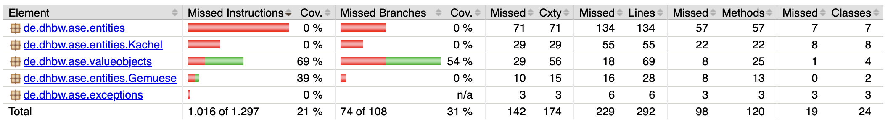

# Programmentwurf
# 1. Einführung
## 1.1 Übersicht über die Applikation
Queensfarming ist ein Gesellschaftsspiel, wo mindestens zwei oder mehr Spieler gegeneinander spielen. Jeder Spieler hat ein eigenes Spielfeld, welches beim Beenden eines Zuges automatisch angezeigt wird. Die Scheune im Feld (0/0) enthält alle Ressourcen, jedes weitere Feld muss zunächst gekauft werden, bevor man Gemüse anbauen kann. Der Kachelstapel hat verschiedene Anbaukacheln in zufälliger Reihenfolge. Die Kosten für eine zufällige Kachelkarte berechnet sich durch den Abstand zur Scheune. Das Gemüse kann im Markt erworben werden. Auch hier kann sich der Preis ändern und berechnet sich je nach Anfrage unterschiedlich. Je nach Kachelart, kann nur bestimmtes Gemüse angebaut werden. Nach Jeder Spielrunde wächst bei jedem Spieler das angebaute Gemüse um Faktor 2. Wenn das Feld keine Kapazität mehr hat, kann der Spieler das Feld ernten und anschließend verkaufen. Ein Spieler darf jeweils nur 4 Aktionen ausführen pro Spielzug (Aktionen: Kachel kaufen, Gemüse kaufen, Kachel ernten, Gemüse anbauen, Gemüse verkaufen).
Es besteht die Möglichkeit in einer Fabrik Produkte (Brot, Salat) aus bestimmten Ressourcen zu produzieren. Voraussetzung ist das die Fabrik mindestens einen freien Arbeiter hat und die benötigten Ressourcen in der Scheune. Wenn nach einer bestimmten Rundenanzahl das Produkt fertig ist, kommt es in eine Queue, wo immer das oberste zuerst verkauft werden kann. So besteht die Möglichkeit schnelles Geld zu verdienen.
Beim Starten des Spiels werden drei Fragen gestellt. (Wie viele Spieler? Mit wie viel Gold soll ein Spieler starten? Mit wie viel Gold hat ein Spieler gewonnen?) Danach werden die Namen der Spieler abgefragt. Wer als erstes das Zielgold durch schlaues Wirtschaften und Anbauen von Gemüse erreicht hat, gewinnt das Spiel.


## 1.2 Wie startet man die Applikation?

**Voraussetzungen:**
- Java Development Kit (JDK) Version 21
- Apache Maven Version 3.9.9
 
**Schritt-für-Schritt-Anleitung:**

1. **Repository klonen:**
   ```sh
   git clone https://github.com/manuel-brs/Queensfarming.git
   cd Queensfarming
   ```

2. **Projekt bauen:**
   ```sh
   mvn clean install
   ```

3. **Applikation starten:**
   ```sh
   mvn exec:java -Dexec.mainClass="de.sri.Main"
   ```
4. **Applikation über die Konsole verwenden:**

 
## 1.3 Wie testet man die Applikation?
```sh
mvn test
```

Die Testergebnisse werden im Terminal angezeigt. 

# 2. Clean Architecture

## 2.1 Was ist Clean Architecture?

Clean Architecture ist ein Softwarearchitekturprinzip von Robert C. Martin, das Systeme flexibel, wartbar und unabhängig von äußeren Abhängigkeiten macht. Es folgt einer Schichtenstruktur:
1.	Domain-Model: Zentrale Geschäftslogik.
2.	Application-Layer: Anwendungsspezifische Logik und Steuerung des Datenflusses.
3.	Interface Adapters: Vermittlung zwischen Logik und externen Systemen.
4.	Frameworks & Drivers: Äußere Systeme wie Datenbanken und UI.

Das Modell trennt Zuständigkeiten, erleichtert Tests und macht die Software unabhängig von Frameworks oder Datenbanken. Ziel der Architektur ist es, dass der Kern der Anwendung lange Zeit nicht verändert werden muss. Hingegen können sich äußere Abhängigkeiten wie Frameworks und exter-ne Libraries häufig geändert werden. Diese sollten leicht austauschbar sein.


## 2.2 Analyse der Dependency Rule
Aufgrund der Projektstruktur wird die Dependency Rule der Clean Architecture immer befolgt und kann nicht dagegen verstoßen werden. Deswegen werden zwei positive Beispiele aufgeführt.

```shell
├── queensfarming-ui
├── queensfarming-application
├── queensfarming-domain
├── README.md
└── pom.xml
```


### 2.2.1 Positiv-Beispiel: `SpielRepositoryImpl`


**Analyse:**

- **Abhängigkeiten:** `SpielRepositoryImpl` hängt von dem Interfaces `SpielRepository` und einer Entity Klassen ab.
- **Einhaltung der Dependency Rule:** Die Klasse `SpielRepositoryImpl` befindet sich in der Applikations-Schicht und die abhängende Entität befindet sich in der Domain-Schicht. Dies entspricht der Dependency Rule, da die Abhängigkeiten von außen nach innen verlaufen und nicht umgekehrt.

### 2.2.2 Positiv-Beispiel: `SpielfeldRepositoryImpl`


**Analyse:**

- **Abhängigkeiten:** `SpielfeldRepositoryImpl` implementiert das Interface `SpielfeldRepository` und zwei Entity Klassen ab.
- **Einhaltung der Dependency Rule:** Die Klasse `SpielfeldRepositoryImpl` befindet sich in der Applikations-Schicht und die abhängenden Entitäten befinden sich in der Domain-Schicht. Dies entspricht der Dependency Rule, da die Abhängigkeiten von außen nach innen verlaufen und nicht umgekehrt.

## 2.3 Analyse der Schichten

Es gibt kein direktes Beispiel, wo eine Code-Abhängigkeit einer Innere Schicht auf eine Äußere Schicht zeigt. Dies lässt auch Maven nicht zu, da die einzelnen Module als Dependency verlinkt werden müssen.

### 2.3.1 Schicht: Applikations-Schicht

**Klasse: `AgrarModulImpl`**


**Beschreibung der Aufgabe:**

Die Klasse `AgrarModulImpl` ist verantwortlich für das Anbauen und Ernten verschiedener Gemüsetypen auf dem Spielfeld. Sie bietet jeweils eine Funktion zum Anbauen und zum Ernten.

**Einordnung in die Clean-Architecture:**

Die Klasse gehört zu der Applikations-Schicht, da sie die Aktionen des Spiels kapselt von der Domäne. Sie stellt sicher, dass die Geschäftslogik unabhängig von der Datenpersistenz bleibt und nur über Abstraktionen (Interfaces) mit der Datenbank interagiert. Das Interface gehört zur Domain-Schicht.

### 2.3.2 Schicht: Domain-Schicht

**Klasse: `Fabrik`**


**Beschreibung der Aufgabe:**

Die Klasse `Fabrik` repräsentiert eine Fabrik, welche jeder Spieler besitzt, um Produkte zu entwickeln. Sie enthält alle relevanten Informationen über die Fabrik, wie die Anzahl der Arbeiter, Kosten zum Update, etc.

**Einordnung in die Clean-Architecture:**

Die Klasse gehört zur Domain-Schicht, da sie eine zentrale Rolle in der Domäne der Applikation spielt und die wesentlichen Informationen der Fabrik kapselt. Sie ist unabhängig von anderen Schichten und kann in verschiedenen Klassen der Applikations-Schicht konsumiert werden.

# 3. SOLID
## 3.1 Analyse Single-Responsibility-Principle (SRP)
 
### 3.1.1 Positiv-Beispiel: `KaufeLandImpl`
 


 
**Beschreibung der Aufgabe:**
Die Klasse `KaufeLandImpl` hat nur eine einzige Verantwortung: den Kauf einer bebaubaren Kachel. Sie erfüllt das SRP, da sie nur eine Aufgabe hat und diese klar definiert ist.
 
### 3.1.2 Negativ-Beispiel: `ConsoleAdapter`
 


 
**Beschreibung der Aufgaben:**
Die Klasse `ConsoleAdapter` hat mehrere Verantwortlichkeiten: Benutzereingaben entgegen zu nehmen, Benutzereingaben weiter zu leiten an usecases, außerdem ist die Spiellogik enthalten, also wie viele Aktionen ein Spieler durchführen darf.
 
**Möglicher Lösungsweg:**
Aufteilung der Aufgaben. Eine Template funktion könnte für alle Usecases genutzt werden, die im ersten Schritt überprüft, ob die anzahl an max Aktionen erreicht wurde.
 
## 3.2 Analyse Open-Closed-Principle (OCP)
### 3.2.1 Positiv-Beispiel: `BebaubareKachel`
 


 
**Analyse:**
Die Klasse `BebaubareKachel` ist offen für Erweiterungen, da weitere Funktionalitäten hinzugefügt werden können, ohne die bestehende Klasse zu ändern. Es kann durch die Vererbung einfach weitere Felder generiert werden.
 
### 3.2.2 Negativ-Beispiel: `AgrarModulImpl`
 


 
**Analyse:**
Diese Klasse `AgrarModulImpl` verstößt gegen das Open-Closed-Principle, weil ihre Methoden hart codierte Logik enthalten, die bei Änderungen an den Spielregeln oder neuen Kacheltypen angepasst werden muss. Dadurch muss die Klasse geändert werden, anstatt durch Vererbung oder Erweiterung erweitert zu werden. Zum Beispiel führen alle if-Abfragen zu konkreten Kacheltypen und Inventarlogik zu hoher Kopplung und machen die Klasse unflexibel für Erweiterungen.

**Möglicher Lösungsweg:**
Ein möglicher Lösungsweg ist, die Logik zum Bearbeiten von Kacheln in separate Strategien oder Handler auszulagern, z. B. über ein KachelAktionStrategy-Interface. Dadurch kann AgrarModulImpl offen für Erweiterungen bleiben, da neue Kacheltypen oder Spielregeln durch neue Strategien ergänzt werden, ohne die Klasse selbst zu ändern. Die Klasse delegiert dann nur noch die Aktionen an die jeweilige Strategie basierend auf dem Kacheltyp. 
 
## 3.3 Analyse Interface-Segregation-Principle (ISP)
 
### 3.3.1 Positiv-Beispiel: `MarktRepository`und `FabrikRepository`

**Analyse:**
Die Interfaces `MarktRepository` und `FabrikRepository` sind nach ihren Aufgabenbereichen aufgeteilt. Das MarktRepository ist nur für die Speicherung des Marktes zuständig und das FabrikRepository nur für die Fabrik.
 
**Interface:** `MarktRepository`

 
**Interface:** `FabrikRepository`

 
 
### 3.3.2 Negativ-Beispiel: `FabrikModul`

 
**Analyse:**
Das Interface `FabrikModul` hat drei Methoden. Jede dieser Methoden wird zwar nur von einer Klasse implementiert, daher auf den ersten Blick kein verstoß, dennoch würde ich behaupten, dass das Verkaufen von Produkten gar nicht in der Fabrik implementiert werden sollte, sondern im Markt.
 
**Möglicher Lösungsweg:**
Die Methode verkaufeProdukt auslagern und im Markt implementieren.

# 4. Weitere Prinzipien  
## 4.1 Analyse GRASP: Geringe Kopplung
### 4.1.1 Positives-Beispiel: `ErntePreis`


**Analyse:**
Die Klasse ErntePreis ist mit geringer Kopplung gestaltet, da sie nur von einer einzigen, klar definierten Klasse (GemueseTyp) abhängt. Sie enthält keine komplexen Abhängigkeiten oder Logik, sondern arbeitet mit einfachen Datenwerten. Dadurch ist sie leicht verständlich, gut testbar und unabhängig vom restlichen System wiederverwendbar. Änderungen an anderen Teilen des Systems haben in der Regel keinen Einfluss auf ErntePreis, was die Wartbarkeit und Flexibilität des Designs erhöht.

### 4.1.2 Negatives-Beispiel: `FabrikRepository`


**Analyse:**
Die Klasse FabrikRepositoryImpl weist keine geringe Kopplung auf, da sie fest an eine konkrete Datenstruktur (HashMap) gebunden ist und ihre Abhängigkeiten intern selbst erzeugt. Dadurch ist sie nur schwer erweiterbar oder austauschbar, etwa für persistente Speicherlösungen. Zudem erfolgt keine Trennung von fachlicher und technischer Verantwortung, was die Wiederverwendbarkeit und Testbarkeit einschränkt.

**Möglicher Lösungsweg:**
Ein möglicher Lösungsweg ist die Einführung von Dependency Injection, bei der die Speicherstruktur (z. B. eine Map oder ein Datenbank-Repository) über Interfaces von außen bereitgestellt wird. Dadurch wird die Klasse entkoppelt, besser testbar und flexibler gegenüber zukünftigen Änderungen der Datenhaltung.

## 4.2 Analyse GRASP: Hohe Kohäsion

**Klasse:** ``


**Begründung:**
Alle Attribute (name, preis, rundenzumbacken) und Methoden der Klasse beziehen sich direkt auf das Modell eines Produkts und dessen Eigenschaften. Die Klasse erfüllt ausschließlich Aufgaben, die thematisch eng zusammenhängen — nämlich die Beschreibung eines Produkts und dessen Vergleich. Es gibt keine Methoden oder Attribute, die inhaltlich zu einem anderen Themengebiet gehören. Dadurch ist die Klasse überschaubar, klar strukturiert und gut wartbar.


## 4.3 Don’t Repeat Yourself (DRY)
**Commit Hash:** aa9a3bd7b227b589537f838066d1572c77a0b08b

**Begründung:**
Durch die Template Function wurde es möglich, dass nicht vor jeder Spielaktion die AktionsCounter-Überpüfung implementiert wurden musste, sondern die Funktion wurde an alle Aktionen implementiert.


# 5. Unit Tests
## 5.1 Zehn Unit Tests - Tabelle 
 
| Unit Test | Beschreibung |
|-----------|--------------|
| `SpielerManagerRepositoryImpl::testSpeicherUndLadeSpieler` | Testet ob ein Spieler korrekt geladen und gespeichert wird. |
| `SpielerManagerRepositoryImpl::testLadeAlleSpieler` | Testet ob alle Spieler über das Repository korrekt zurück geliefert werden. |
| `SpielerManagerRepositoryImpl::testSpeicherSpielerThrowsOnNegativeId` | Testet ob das Hinzufügen einer falschen SpielerId erkannt wird. (bzw. ein Fehler wirft) |
| `SpielerManagerRepositoryImpl::testSpeicherSpielerThrowsOnNullSpieler` | Testet ob ein Fehler geworfen wird, wenn kein gültiges Spieler objekt gespeichert wird. |
| `SpielerManagerRepositoryImpl::testLadeSpielerThrowsWhenNotFound` | Testet ob ein Fehler geworfen wird, wenn beim Abfragen einer ungültigen SpielerId der richtige Fehler geworfen wird. |
| `ErntePreisTest::create_valid_erntepreis` | Testet das Erzeugen eines Erntepreises. |
| `ErntePreisTest::create_erntepreis_with_null_gemüsetyp_should_throw` | Testet die Fehlermeldung beim Anlegen eines Erntepreises mit ungültigen GemüseTyp |
| `ErntePreisTest::create_erntepreis_with_negative_anzahl_should_throw` | Testet die Fehlermeldung beim Anlegen eines Erntepreises mit negativer Anzahl |
| `Product::create_valid_produkt` | Testet das Verhalten beim Erzeugen eines gültigen Produktes |
| `Product::create_invalid_produkt_with_null_name` | Testet das Verhalten bei Erzeugung eines Produktes mit einem ungültigen Namen. |
 
## 5.2 ATRIP
### 5.2.1 ATRIP: Automatic
 
**Begründung für automatisches Testen**

JUnit-Tests werden in einem Maven-Projekt automatisch während der Test-Phase ausgeführt, weil Maven das `maven-surefire-plugin` standardmäßig verwendet. Dieses Plugin ist darauf ausgelegt, JUnit-Tests zu erkennen und auszuführen.
 
### 5.2.2 ATRIP: Thorough 
#### 5.2.2.1 Positiv-Beispiel
 
**Code-Beispiel:**

```java
@Test
void to_string_should_be_readable() {
        Produkt produkt = new Produkt("Brot", 200, 3);
        assertEquals("Brot (200€, 3 Runden)", produkt.toString());
    }
```
 
**Analyse und Begründung:**
Der Test entspricht dem "Don't Strip Through"-Prinzip, weil er nicht auf interne Felder oder Getter zugreift, sondern das beobachtbare Verhalten über die öffentliche Methode toString() prüft. Dadurch bleibt der Test unabhängig von der internen Implementierung und testet das Objekt so, wie es sich nach außen präsentiert.
 
#### 5.2.2.2 Negativ-Beispiel

**Code-Beispiel:**
```java
@Test
void create_valid_produkt() {
    Produkt produkt = new Produkt("Brot", 200, 3);
    assertEquals("Brot", produkt.getName());
    assertEquals(200, produkt.getPreis());
    assertEquals(3, produkt.getRundenzumbacken());
}
```
 
**Analyse und Begründung:**
Dieser Test überprüft interne Getter (getName(), getPreis(), getRundenzumbacken()), statt das Verhalten des Objekts zu testen. Das "Strip Through" (bzw. "Don't Strip Through") Prinzip besagt, dass Unit-Tests nicht durch das Objekt "hindurchgreifen" sollten, um dessen Zustand direkt zu inspizieren – sondern stattdessen öffentliche Methoden testen sollten, die den Zustand in Verhalten umsetzen.

### 5.2.3 ATRIP: Professional
#### 5.2.3.1 Positiv-Beispiel

```java
@Test
    void testValidProduktCreation() {
        Produkt produkt = new Produkt("Brot", 5, 2);
        assertEquals("Brot", produkt.getName());
        assertEquals(5, produkt.getPreis());
        assertEquals(2, produkt.getRundenzumbacken());
    }
```

**Begründung:**
Der Test testValidProduktCreation() entspricht professionellen Standards, da er die zentrale Funktionalität der Produkt-Klasse überprüft: die korrekte Initialisierung der Attribute. Durch gezielte Assertions werden alle relevanten Felder (name, preis, rundenzumbacken) mit den erwarteten Werten abgeglichen. Dies stellt sicher, dass der Konstruktor die Daten richtig verarbeitet und die Getter-Methoden korrekt arbeiten. Die klare Struktur und präzise Zielsetzung des Tests fördern eine verständliche und wartbare Testbasis, die schnell Rückschlüsse auf Fehler im Objektmodell ermöglicht.

#### 5.2.3.2 Negativ-Beispiel
```java
@Test
    void testProdukt() {
        Produkt produkt = new Produkt("Brot", 5, 2);
        assertNotNull(produkt);
    }
```

**Begründung:**
Unvollständiges Testen: Es wird lediglich die Objekterstellung geprüft, ohne die Werte der einzelnen Felder oder ungültige Eingaben zu überprüfen. Keine Fehlerbehandlung: Es werden keine Ausnahmen oder fehlerhafte Eingabefälle getestet. Unklare Benennung: Der Name der Testmethode ist allgemein gehalten und beschreibt nicht klar ihren Zweck. Begrenzte Überprüfungen: Es wird nur geprüft, ob das Objekt nicht null ist, was für einen aussagekräftigen Test nicht ausreicht.

#### 5.2.3.1 Positiv-Beispiel
**Code-Beispiel:**

```java
@Test
void add_policy_with_too_high_car_value() {
    Customer customer = new TestCustomerDirector(new Customer.Builder()).createMockUser();
    when(customerRepository.findById(1)).thenReturn(Optional.of(customer));
 
    Policy policy = new Policy(1, PolicyStatus.ACTIVE, PolicyProgram.BASIC, 120000);
    CarTooExpensiveException exception = assertThrows(CarTooExpensiveException.class, () -> policyManagement.addPolicyToCustomer(1, policy));

    assertEquals("Car value cannot be more than 100000!", exception.getMessage());
}
```
 
**Analyse und Begründung:**

Dieser Test ist professionell, da er sicherstellt, dass die richtige Ausnahme geworfen wird, wenn der Autowert zu hoch ist. Er verwendet klare und verständliche Assertions und überprüft die Fehlermeldung der Ausnahme. Die Verwendung der Hilfsklasse `TestCustomerDirector` zur Erstellung von Customer-Objekten trägt zur Übersichtlichkeit bei, da sie es ermöglicht, auf einfache Weise unterschiedliche Customer-Objekte für diverse Testszenarien zu generieren.
 
#### 5.2.3.2 Negativ-Beispiel
 
**Code-Beispiel:**

```java
@Test
void save_policy() {    
    Customer customer = this.repository.findById(1).get();
    Policy policy = new Policy(0, PolicyStatus.ACTIVE, PolicyProgram.DELUXE, 30000.0);

    customer.addPolicy(policy);
    Customer savedCustomer = repository.save(customer);

    assertNotNull(savedCustomer.getId());
    assertEquals(2, this.repository.findById(savedCustomer.getId()).get().getPolicies().size());
}
```
 
**Analyse und Begründung:**

Dieser Test ist nicht professionell, da das Policy Objekt manuell erstellt und somit nicht wiederverwendt werden kann. Dadurch müssen bei Änderungen der Policy Klasse sämtliche Tests angepasst werden.
 
## 5.3 Code Coverage
 
In diesem Projekt erfolgt die Messung der Testabdeckung mithilfe des Tools JaCoCo. Ein hoher Abdeckungsgrad weist darauf hin, dass ein großer Teil des Codes durch automatisierte Tests überprüft wird, was grundsätzlich das Risiko von Fehlern senken kann. Dennoch sollte man sich bewusst sein, dass ein hoher Coverage-Wert nicht automatisch die Korrektheit des Programms garantiert. Unzureichende oder falsch formulierte Tests können dazu führen, dass Defekte unentdeckt bleiben. Um eine verlässliche Codebasis sicherzustellen, sollten daher sowohl Tests für korrekte Abläufe als auch Tests für Ausnahme- und Fehlerszenarien berücksichtigt werden.

**Analyse und Begründung:**

Domain-Schit:

Application-Schicht:


## 5.4 Fakes und Mocks

### 5.4.1 Mock-Objekt
In den Tests wird das `SpielRepository`, `SpielfeldRepository`, `MarktRepository` und `SpielerManagerRepository` gemockt.


 
**Code-Beispiel:**
```java
public class AgrarModulImplTest {
    @Mock
    SpielRepository spielRepository;

    @Mock
    SpielfeldRepository spielfeldRepository;

    @Mock
    MarktRepository marktRepository;

    @Mock
    SpielerManagerRepository spielerManagerRepository;

    AgrarModulImpl agrarModul;

    @BeforeEach
    public void setup() {
        MockitoAnnotations.openMocks(this);
        agrarModul = new AgrarModulImpl(spielRepository, spielfeldRepository, marktRepository, spielerManagerRepository);
    }

    @Test
    void testAnbauenGemüseErfolgreich() throws Exception {
        // Mocks vorbereiten
        Spiel spiel = mock(Spiel.class);
        Spieler spieler = mock(Spieler.class);
        Spielfeld spielfeld = mock(Spielfeld.class);
        Markt markt = mock(Markt.class);
        Scheune scheune = mock(Scheune.class);

        // Gemeinsame GemüseTyp-Instanz
        GemueseTyp tomate = new GemueseTyp("Tomate", 1, 3, 2);

        // Inventar mit Tomate füllen
        Map<GemueseTyp, Integer> inventar = new HashMap<>();
        inventar.put(tomate, 2);

        when(spielRepository.get()).thenReturn(spiel);
        when(spiel.getSpielerAmZug()).thenReturn(1);
        when(spielerManagerRepository.ladeSpieler(1)).thenReturn(spieler);
        when(spielfeldRepository.ladeSpielfeld(spieler)).thenReturn(spielfeld);
        when(marktRepository.get()).thenReturn(markt);
        when(spielfeld.getScheune()).thenReturn(scheune);
        when(scheune.getInventar()).thenReturn(inventar);

        // Spielfeld mit Kacheln
        BebaubareKachel kachel = mock(BebaubareKachel.class);
        Kachel[][] kacheln = new Kachel[5][5];
        kacheln[4 - 1][1 + 2] = kachel;

        when(spielfeld.getSpielfeld()).thenReturn(kacheln);
        when(kachel.getAngebaut()).thenReturn(null);
        when(kachel.baueGemüseAn(tomate)).thenReturn(true);

        // Methode testen
        agrarModul.anbauenGemüse(1, 1, tomate);

        // Prüfen, ob Inventar reduziert wurde
        assertEquals(1, inventar.get(tomate));

        // Prüfen, dass baueGemüseAn aufgerufen wurde
        verify(kachel).baueGemüseAn(tomate);
    }
}
```
**Beschreibung:**
Die Mock-Objekte *spielRepository*, *spielfeldRepository*, *marktRepository* und *spielerManagerRepository*, simulieren das Verhalten der Interfaces. Es wird verwendet, um die Abhängigkeit von der realen Implementierung zu isolieren und die Geschäftslogik von `AgrarModulImpl` unabhängig zu testen. In diesem Test wird das Verhalten das Anbauen von Gemüse getestet.

# 6. Domain-Driven-Design (DDD)
## 6.1 Ubiquitous Language
### 6.1.1 Entities
- Spieler
	- Teilnehmer des Spiels, der verschiedene Aktionen durchführen kann
	- Der Begriff Spieler ist zentral für die Domäne des Spiels und wird in vielen Kontexten verwendet, um die Entitäten zu beschreiben, die das Spiel spielen.
- Markt
	- Ein Ort im Spiel, an dem Spieler Gemüse kaufen und verkaufen können.
	- Der Markt ist ein wesentlicher Bestandteil der Spielmechanik.
- Aktion
	- Eine Handlung, die ein Spieler im Spiel ausführen kann, wie z.B. Pflanzen, Ernten oder Kaufen.
	- Aktion ist ein grundlegendes Konzept im Spiel, das die möglichen Interaktionen der Spieler beschreibt und daher in der Ubiquitous Language verankert ist.
- Fabrik
	- Eine Einrichtung im Spiel, in der Spieler Produkte herstellen können.
    - Die Fabrik ist ein spezifischer Begriff innerhalb der Domäne, der die Produktionsmechanik des Spiels beschreibt.
                                                                                                                     
## 6.2 Entities


**Beschreibung**  
Die Klasse *Spieler* ist eine Entity, weil sie eine eindeutige Identität besitzt, die sich über die Lebensdauer des Spiels hinweg nicht ändert. Jeder Spieler hat individuelle Eigenschaften und Zustände, die ihn von anderen Spielern unterscheiden. Die Verwendung einer Entity ist hier sinnvoll, um die verschiedenen Spieler im Spiel eindeutig zu identifizieren und ihre spezifischen Zustände und Aktionen zu verwalten.


## 6.3 Value Objects


**Beschreibung:**
Das Value-Objekt repräsentiert den Preis den ein Spieler zahlen muss um das Gemüse zu kaufen oder verkaufen.

**Begründung des Einsatzes:**  
ErntePreis wird als Value Object modelliert, weil:  
1. Es keine eigene Identität hat - zwei Objekte mit den gleichen Werten sind austauschbar
2. Es unveränderlich (immutable) ist - Änderungen erzeugen ein neues Objekt.  
3. Es Verhaltenslogik enthält


## 6.4 Aggregates


**Beschreibung und Begründung:**  
Das Aggregat Fabrik bündelt mehrere miteinander in Beziehung stehende Value Objects (Produkt und ProduktMenge) zu einer transaktionalen Einheit. Es stellt sicher, dass alle Invarianten (z. B. Rezeptregeln, Produktionslogik, Bearbeitungsrunden) zentral in der Fabrik definiert und eingehalten werden.

Nur Fabrik ist von außen zugänglich – alle abhängigen Objekte werden intern verwaltet. Dies verhindert inkonsistente Zustände, etwa eine ProduktMenge, die ohne Kontext bearbeitet wird.


## 6.5 Repositories


**Beschreibung:**  
Das Repository *SpielerManagerRepositoryIml* ist verantwortlich für die Persistenz und das Abrufen des Spiel Objektes

**Begründung des Einsatzes:**  
Ein Repository für SpielerManagerRepositoryIml wird eingesetzt, weil:  
1. Es die Datenzugriffslogik von der Geschäftslogik trennt.  
2. Es eine Abstraktion der Datenpersistenz bietet, wodurch die zugrunde liegende Datenbank ohne Änderungen an der Geschäftslogik geändert werden kann.

# 7. Refactoring
## 7.1 Code Smells
### 7.1.1 Long Method
**Code-Beispiel**: Die Methode baueGemüseAn in Spielfeld ist zu lang und enthält zu viele Verantwortlichkeiten.
```java
    public boolean baueGemüseAn(GemueseTyp gemüse) {
        for (GemueseTyp gemueseTyp : this.anbaubaresgemüse) {
            if (gemueseTyp.getGemüsename().equals(gemueseTyp.getGemüsename())) {
                if (this.angebaut == null) {
                    this.angebaut = gemüse;
                    this.wachstumsstatus ++;
                    return true;
                }
            }
        }
        return false;
    }
```

**Möglicher Lösungsweg**: Aufteilung der Methode in kleinere Methoden, die jeweils eine einzelne Verantwortung haben.

```java
public boolean baueGemüseAn(GemueseTyp gemüse) {
    if (!istAnbaubar(gemüse)) return false;
    if (!istFeldFrei()) return false;

    anbaue(gemüse);
    beginneWachstum();

    return true;
}

private boolean istAnbaubar(GemueseTyp gemüse) {
    return Arrays.stream(this.anbaubaresgemüse)
                 .anyMatch(g -> g.getGemüsename().equals(gemüse.getGemüsename()));
}

private boolean istFeldFrei() {
    return this.angebaut == null;
}

private void anbaue(GemueseTyp gemüse) {
    this.angebaut = gemüse;
}

private void beginneWachstum() {
    this.wachstumsstatus++;
}

```


### 7.1.2 Duplicated Code
**Code-Beispiel**: Die Methoden wachsen in Klasse Spielfeld und BebaubareKachel, überprüfen beide ob die Kachel Null ist. Das ist eine Dopplung und sollte entfernt werden.

```java
    // class Spielfeld
    public void wachsen() {
        for (Kachel[] kachelarray : spielfeld) {
            for (Kachel kachel : kachelarray) {
                if (!(kachel instanceof Scheune) && kachel != null) {
                    ((BebaubareKachel) kachel).wachsen();
                }
            }
        }
    }
    // class BebaubareKachel
    public void wachsen() {
        if (angebaut != null && this.wachstumsstatus < this.kapazität) {
            this.wachstumsstatus = this.wachstumsstatus * 2;
            if (this.wachstumsstatus > this.kapazität) {
                this.wachstumsstatus = this.kapazität;
            }
        }
    }
```

**Möglicher Lösungsweg**: Eine Überprüfung entfernen. Leider muss vorher gecastet werden weshalb die IF-Abfrage zum überprüfen auf Scheune notwendig ist, sonst müsste man den Fehler behandeln.

```java
    // class Spielfeld
    public void wachsen() {
        for (Kachel[] kachelarray : spielfeld) {
            for (Kachel kachel : kachelarray) {
                if (!(kachel instanceof Scheune) && kachel != null) {
                    ((BebaubareKachel) kachel).wachsen();
                }
            }
        }
    }
    // class BebaubareKachel
    public void wachsen() {
        if (this.wachstumsstatus < this.kapazität) {
            this.wachstumsstatus = this.wachstumsstatus * 2;
            if (this.wachstumsstatus > this.kapazität) {
                this.wachstumsstatus = this.kapazität;
            }
        }
    }
```

## 7.2 Refactorings
In Commit `9d588d8c3735e128ac1ad7d14503ba858ba925df` und `da7a678afa65569432086373116b2783f546ed02` wurde ein umfangreiches Refactoring durchgeführt. Dabei wurde die UI, Template Function entfernt.

### 7.2.1 Removed UI
Da eine Änderung in der UI umfangreiche Änderungen im restlichen Code mitsich zogen, wurde sich dazu entschieden das UI wegzulassen. Die UI war nicht gut abgekapselt von der Anwendungslogik und sorgte somit für unnötige Komplexität.

**vorher:**


In der Starter Klasse wurde das GUI Objekt erzeugt und das Spiel Objekt, den Controller, sowie den Markt an die GUI übergeben.

**nachher:**

Die Klasse Console Adapter ist einfach erweiterbar, wenn neue Aktionen gepfegt werden müssen. Dieses Klasse nimmt die Befehle übe die CLI ein und verarbeitet sie weiter, so dass nur eine Switch Case Anweisung erweitert werden muss, so wie der Aufruf der Aktion.

```mermaid
classDiagram
    class Starter {
        +main(String[] args)
    }

    class ConsoleAdapter {
        +start(List<String> spieler, int startGold, int zielGold)
        -zeigeAktionen()
        -handleOptionen(String choice)
        -verkaufeProdukte()
        -produziereProdukt()
        -upgradeFabrik()
        -zeigeFabrik()
        -checkAktionsCounter()
        -beendeZug()
    }

    Starter --> ConsoleAdapter : uses

```

### 7.2.2 Einführung von Repositories
Vor dem Refactoring gab es eine Spiel Instanz, welche den Zugriff auf alle anderen Objekte gegeben hat. Dieses Spiel Objekt wurde sehr umfangreich und wurde an jede weitere Schicht weiter gegeben. Diese Klasse hatte dann sehr viele Verantwortlichkeiten und enthielt die komplette Spiellogik. Somit kümmerte sich die Spielklasse um alle wichtigen Objekte: Markt, Spieler - welche wiederum das Spielfeld hatten


**vorher:**
```mermaid
classDiagram
    class Spiel {
        -SpielController gameController
        -List<Spieler> spieler
        -Spieler aktuellerSpieler
        -Markt markt
        -boolean spielaktiv
        -int spieleramzug
        -final int zielGold
        -int aktionszähler
        -String message

        +Spiel(SpielController, int)
        +startSpiel()
        +spielerHinzufügen(Spieler) boolean
        +beendeZug()
        +kaufeGemüse(GemüseTyp) boolean
        +pflanzen(int, int, GemüseTyp) boolean
        +ernten(int, int) boolean
        +verkaufeGemüse(GemüseTyp) boolean
        +produziereProdukt(String) boolean
        +kaufeLand(int, int) boolean
        +upgradeFabrik() boolean
        +sellProdukt() boolean
        +getSpieler() List<Spieler>
        +getAktuellerSpieler() Spieler
        +getMarkt() Markt
        +isSpielaktiv() boolean
        +getSpieleramzug() int
        +getZielGold() int
        +getMessage() String
        +getAktionszähler() int
        +inkrementAktionszähler()
        +setMessage(String)
        +getGameController() SpielController
    }
```

**nachher:**
Nach dem Refactoring wurde die Verantwortlichkeit für die Persistierung an die einzelnen Repositories übergeben. Statt ein Spiel Objekt, welches alle anderen Objekte mitverwaltet, wurde eine granularere Aufteilung vorgenommen.

```mermaid
classDiagram
class FabrikRepositoryImpl {
    -Map<Spieler, Fabrik> fabrikMap
    +ladeAlleFabriken() List<Fabrik>
    +speicherFabrik(Spieler, Fabrik)
    +ladeFabrik(Spieler) Fabrik
}

class MarktRepositoryImpl {
    -Markt markt
    +save(Markt) Markt
    +get() Markt
    +delete()
}

class SpielerManagerRepositoryImpl {
    -Map<Integer, Spieler> spieler
    +speicherSpieler(int, Spieler)
    +ladeSpieler(int) Spieler
    +ladeAlleSpieler() List<Spieler>
}

class SpielfeldRepositoryImpl {
    -Map<Spieler, Spielfeld> spielfeldMap
    +speicherSpielfeld(Spieler, Spielfeld)
    +ladeAlleSpielfelder() List<Spielfeld>
    +ladeSpielfeld(Spieler) Spielfeld
    +loescheSpielfeld(Spieler)
}
```


### 7.2.3 Extract Method (aus der Vorlesung)
Die Funktion baueGemüseAn ist zu lang und sollte Logik auslagern.

**vorher:**
```java
public boolean baueGemüseAn(GemueseTyp gemüse) {
        for (GemueseTyp gemueseTyp : this.anbaubaresgemüse) {
            if (gemueseTyp.getGemüsename().equals(gemueseTyp.getGemüsename())) {
                if (this.angebaut == null) {
                    this.angebaut = gemüse;
                    this.wachstumsstatus ++;
                    return true;
                }
            }
        }
        return false;
    }
```

**nachher:**
```java
public boolean baueGemüseAn(GemueseTyp gemüse) {
    for (GemueseTyp gemueseTyp : this.anbaubaresgemüse) {
        return checkObGemueseAnbaubar(gemueseTyp, gemüse);
    }
    return false;
}
private boolean checkObGemueseAnbaubar(GemueseTyp angebautGemüse, GemueseTyp gemüseTyp) {
    if (angebautGemüse.getGemüsename().equals(angebautGemüse.getGemüsename())) {
        if (this.angebaut == null) {
            this.angebaut = gemüseTyp;
            this.wachstumsstatus ++;
            return true;
        }
    }
    return false;
}
```


### 7.2.4 Rename Method (aus der Vorlesung)
Die Funktion  muss umbenannt werden, da der Name verwirrend ist. Es wird ebenfalls geprüft, ob es erlaubt ist ein Gemüse auf das Feld anzubauen.

**vorher:**
```java
public boolean baueGemüseAn(GemueseTyp gemüse) {
    for (GemueseTyp gemueseTyp : this.anbaubaresgemüse) {
        return checkObGemueseAnbaubar(gemueseTyp, gemüse);
    }
    return false;
}
```

**nachher:**
```java
public boolean versucheGemüseAnzubauen(GemueseTyp gemüse) {
    for (GemueseTyp gemueseTyp : this.anbaubaresgemüse) {
        return checkObGemueseAnbaubar(gemueseTyp, gemüse);
    }
    return false;
}
```

# 8. Design Patterns
Beide Design Patterns sind nach dem [CommitID](https://github.com/manuel-brs/Queensfarming/commit/aa9a3bd7b227b589537f838066d1572c77a0b08b)*aa9a3bd7b227b589537f838066d1572c77a0b08b* wieder entfernt worden. Somit können die beiden Design patterns durch git checkout CommitID angeschaut werden.

## 8.1 Observer-Muster
**Begründung:**
Das Observer-Muster ermöglicht es einem Objekt (dem Subjekt), eine Liste von Abhängigen (Beobachtern) zu führen, die benachrichtigt werden, wenn sich der Zustand des Subjekts ändert. Dies ist nützlich, um lose gekoppelte Systeme zu erstellen, in denen Änderungen an einem Objekt automatisch an andere Objekte weitergegeben werden.


```mermaid
classDiagram
    class ISubjekt {
        <<interface>>
        + registerObserver()
        + unregisterObserver()
        + notifyObservers()
    }

    class IObserver {
        <<interface>>
        + update()
    }

    class SpielController {
        + registerObserver()
        + unregisterObserver()
        + notifyObservers()
    }

    class GUI {
        + update()
        ...
    }

    ISubjekt <|.. SpielController
    ISubjekt --> IObserver
    IObserver <|.. GUI
    SpielController --> GUI

```

## 8.2 Template Function

**Begründung:**
1.	Gerüst des Algorithmus: Die Methode actionExec definiert das Gerüst des Algorithmus. Sie überprüft zuerst den Aktionszähler und führt dann die Aktion aus, wenn die Überprüfung erfolgreich ist.
2.	Delegation an Unterklassen: Die Methode execute ist abstrakt und wird von den Unterklassen implementiert. Dadurch können verschiedene Aktionen unterschiedliche Implementierungen der Methode execute haben.


```mermaid
classDiagram
    class Aktion {
        <<abstract>>
        + actionExec()
        + execute() <abstract>
        - überprüfeActionCounter()
    }

    class ErnteAktion {
        + execute()
    }

    class KaufeGemueseAktion {
        + execute()
    }

    class PflanzenAktion {
        + execute()
    }

    Aktion <|-- ErnteAktion
    Aktion <|-- KaufeGemueseAktion
    Aktion <|-- PflanzenAktion

```